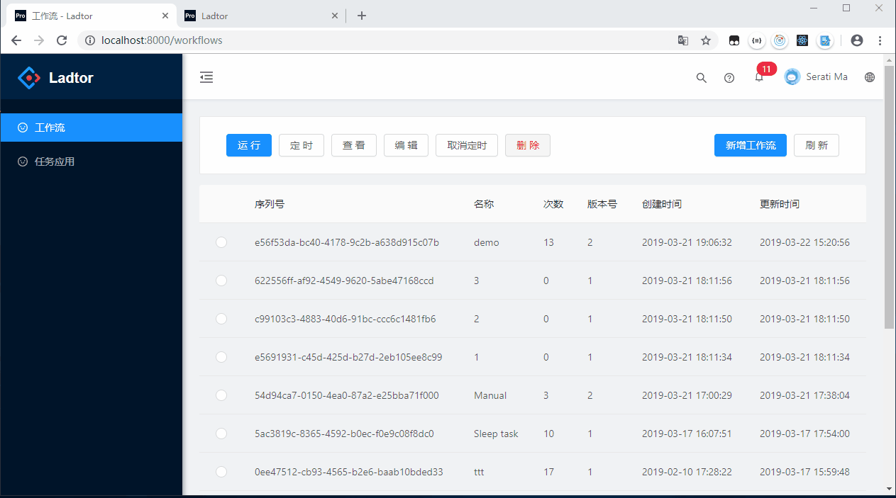

### 节点说明

`结果节点`与`与节点`在所有入度都执行完成后才会执行，其他节点当有一个入度完成时便会执行，所有节点默认至多被执行一次，除在界面手动点击执行外。

- 开始节点

  工作流执行入口

  

- 结果节点

  工作流执行结果出口，关联的所有边到达该节点后，工作流状态会被置为成功，不影响其他节点的执行

  

- 任务节点

  具体执行任务关键节点，执行完成后续手动回调工作流系统，详见[测试节点](../../../workflow-test)

  

- 远程节点

  简单任务或获取数据等Http接口，内部使用RestTemplate支持地址栏`{name}`占位，除此之外，Get方法所有参数都会拼接成queryString传递，Post方法所有参数都会作为Request Body传递。

  

- 子工作流节点

  可以用来触发其他已定义的工作流

  

- 与逻辑节点

  默认情况下的有一条边到达之后该节点就会被执行，后续边到来不会再次被执行，可以通过使用与节点等待所有边都完成后再执行后续节点

  

- 或逻辑节点

  当有一条边到达之后该节点就会被执行

- 手动节点
  需手动点击执行或完成，仅为演示方便而创建。

### 边条件说明

边条件表达式采用MVEL表达式，详见[MVEL](<https://github.com/mvel/mvel>)，语法说明[wiki](<https://en.wikibooks.org/wiki/Transwiki:MVEL_Language_Guide#Language_Guide_for_2.0>)

## demo说明

- RandomVal节点代码详见[Test](../../../Test)
- Sleep节点代码详见[WorkFlow-Test](../../../workflow-test)
  

## [后端项目](../../../workflow)

### 鸣谢

- [Ant Design](<https://github.com/ant-design/ant-design>)
- [Ant Design Pro](<https://github.com/ant-design/ant-design-pro>)
- [AntV G6](<https://github.com/antvis/g6>)
- [G6-Editor](<https://github.com/antvis/g6-editor>)
- [GG-Editor](<https://github.com/gaoli/GGEditor>)
- [React-Stomp](<https://github.com/lahsivjar/react-stomp>)
